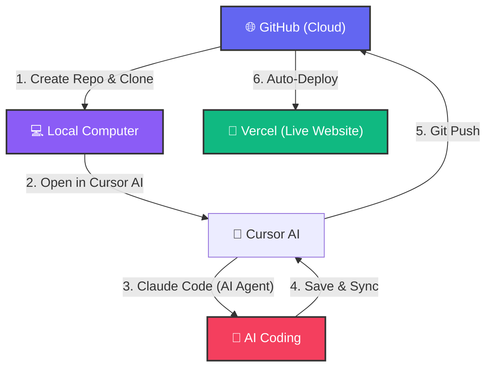

# 🚀 Modern Web Development Workflow Guide

Welcome! This guide is designed to take you from "zero" to "deployed" using modern tools like GitHub, Cursor AI, and Vercel. We've simplified the technical jargon so you can focus on building.

---

## 🗺️ The Big Picture (Flowchart)

This diagram shows how your code travels from your computer to the world.



---

## 🛠️ Step 1: Start with GitHub (The Storage)

GitHub is like "Google Drive" for your code. It keeps your project safe and tracks every change.

### 1. Create a Repository (Repo)
1. Log in to [GitHub.com](https://github.com).
2. Click the **"+"** icon in the top right -> **New repository**.
3. Give it a name (e.g., `my-cool-app`).
4. Keep it **Public** (or Private if you prefer).
5. Click **Create repository**.

### 2. Copy the "Link"
On the next screen, you'll see a box with a URL like `https://github.com/yourname/my-cool-app.git`. Click the **Copy** icon next to it.

---

## 💻 Step 2: Bring the Code to Your Computer (Cloning)

Now we need to download that "empty folder" to your PC.

### 1. Open the Terminal
*   **Windows**: Press `Win + S`, type `PowerShell`, and hit Enter.
*   **Mac**: Press `Cmd + Space`, type `Terminal`, and hit Enter.

### 2. The "Clone" Command
Type this command and paste your link (Right-click or `Ctrl+V` to paste):
```bash
git clone https://github.com/yourname/my-cool-app.git
```
*Press Enter.* This creates a folder on your computer named after your project.

### 3. Enter the Folder
```bash
cd my-cool-app
```

---

## 🤖 Step 3: Connect Claude Code (Your AI Assistant)

Claude Code is an AI that can write code for you directly in your project. We will run it inside **Cursor AI**.

### 1. Open your Folder in Cursor AI
Cursor is a powerful AI-first code editor.
*   Open **Cursor AI**.
*   Go to **File > Open Folder**.
*   Select your `my-cool-app` folder.

### 2. Open the Internal Terminal
In Cursor AI, press `Ctrl + \` ` (the key next to '1') to open the built-in terminal. This is where you talk to Claude.

### 3. Start Claude
Run this command to summon Claude:
```bash
npx @anthropic-ai/claude-code
```
*   **First time?** It will ask you to log in. Follow the link in your browser.
*   **How to use?** Just type things like: *"Create a beautiful landing page for a coffee shop"* or *"Fix the styling in this file."*

---

## 📤 Step 4: Pushing Changes to GitHub

Once Claude (or you) has written some code, you need to send it back to GitHub.

In your terminal, run these 3 commands in order:

1. **Stage the changes:**
   ```bash
   git add .
   ```
2. **Label the changes:** (Tell the team what you did)
   ```bash
   git commit -m "added coffee shop landing page"
   ```
3. **Push to the cloud:**
   ```bash
   git push origin main
   ```

---

## 🚀 Step 5: Deploy to Vercel (Going Live)

Vercel takes your GitHub code and turns it into a real website URL.

1. Go to [Vercel.com](https://vercel.com) and log in with GitHub.
2. Click **Add New...** -> **Project**.
3. You will see your GitHub repositories. Click **Import** next to `my-cool-app`.
4. **Environment Variables (Optional):** 
   *   If your app needs secret keys (like an API key), scroll down to **Environment Variables**.
   *   Put the **Name** in the first box and the **Value** in the second.
5. Click **Deploy**.

**Success!** 🎉 Vercel will give you a link (like `my-cool-app.vercel.app`) that you can share with anyone. Every time you "Push" from Step 4, your website will update automatically!

---

> [!TIP]
> **Pro Tip:** Keep your Cursor AI terminal open with Claude Code running. It's like having a senior developer sitting right next to you!
